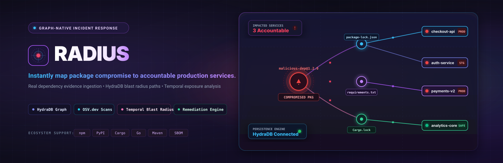
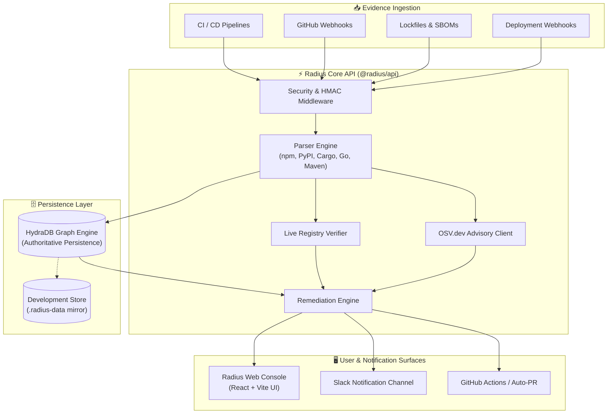

<div align="center">



# 🛡️ Radius

### **Graph-Native Supply-Chain Incident Response & Blast Radius Analysis**

[](https://nodejs.org/)
[](docker-compose.yml)
[](https://osv.dev)
[](https://github.com/sandman-sh/Radius)
[](.github/workflows)
[](https://slack.com)
[](https://github.com/sandman-sh/Radius/pulls)

<p align="center">
  <a href="#-quick-start"><b>Quick Start</b></a> •
  <a href="#-capabilities"><b>Capabilities</b></a> •
  <a href="#-architecture"><b>Architecture</b></a> •
  <a href="#-http-api-reference"><b>API Reference</b></a> •
  <a href="#-configuration"><b>Configuration</b></a> •
  <a href="#-integrations"><b>Integrations</b></a> •
  <a href="#-security"><b>Security</b></a>
</p>

</div>

---

## 📌 Overview

**Radius** is an enterprise-grade, graph-native supply-chain incident response platform. In the critical first minutes of a dependency compromise (such as a hijacked npm package or backdoored PyPI release), security and engineering teams need definitive answers:

> *Which production services actually resolved and deployed the affected version during the compromise window? What is the exact dependency path? Who owns the service, and what is the non-breaking remediation path?*

Radius answers these questions in real time. It ingests authentic build and deployment lockfiles/SBOMs, establishes temporal relationships inside **HydraDB**, cross-references with **OSV.dev** and public package registries, and computes a provable **blast radius** with inspectable evidence paths and automated remediation workflows.

---

## ⚡ Key Capabilities

```
  ┌──────────────────────┐      ┌─────────────────────────┐      ┌─────────────────────────┐
  │  Multi-Format Ingest │ ───► │  HydraDB Graph Analysis │ ───► │ Automated Remediation   │
  │  npm, PyPI, Cargo,   │      │  Temporal blast radius  │      │ GitHub PRs, OSV scans,  │
  │  Go, Maven, SBOMs    │      │  & provenance paths     │      │ Slack notifications     │
  └──────────────────────┘      └─────────────────────────┘      └─────────────────────────┘
```

- **Universal Dependency Ingestion**: Native parsing for `package-lock.json`, `npm-shrinkwrap.json`, `requirements.txt`, `Pipfile.lock`, `poetry.lock`, `uv.lock`, `Cargo.lock`, `go.mod`, `pom.xml`, `CycloneDX JSON`, and `SPDX JSON`.
- **Temporal Blast Radius Engine**: Evaluates exposure by intersecting dependency-resolution and deployment timestamps with the vulnerability disclosure window.
- **Authoritative HydraDB Persistence**: Uses high-throughput batch `UNWIND` writes and typed graph edges (`RESOLVES`, `DEPENDS_ON`, `HAS_DEPLOYMENT`, `USES_LOCKFILE`).
- **Live Registry & OSV.dev Verification**: Real-time scans against OSV.dev and live registry metadata (npm, PyPI) to detect maintainer changes, provenance anomalies, and typosquats.
- **Deterministic Remediation**: Calculates ecosystem-specific upgrade and downgrade recipes without fabricating unverified target versions when no fix is published.
- **CI/CD & ChatOps Ready**: Integrated GitHub Actions for automated pull request creation, signed deployment webhooks, and Slack alert dispatching.
- **Observability Built-in**: Full Prometheus metrics (`/api/metrics`), health probes (`/api/health`, `/api/ready`), and graph statistics.

---

## 🏗️ Architecture

Radius combines an Express API service, a React/Vite analytics console, an authoritative HydraDB graph persistence layer, and external threat intelligence APIs.



### Component Overview

| Component | Directory | Responsibility |
| :--- | :--- | :--- |
| **Web Console** | `apps/web` | React/Vite web application for ingestion visualization, incident triaging, graph exploration, and remediation triggering. |
| **Core API** | `apps/api` | Express service executing lockfile parsing, registry verification, OSV scanning, HydraDB graph queries, and security middleware. |
| **HydraDB** | `docker-compose.yml` | Graph database maintaining nodes (`Service`, `Deployment`, `Package`, `Version`, `Lockfile`) and directional impact edges. |
| **CI Workflows** | `.github/workflows` | Pre-configured GitHub Actions for continuous lockfile ingestion and repository-dispatch pull request automation. |

---

## 🚀 Quick Start

### 1. Clone the Repository

```bash
git clone https://github.com/sandman-sh/Radius.git
cd Radius
```

### 2. Configure Environment Variables

```bash
# On macOS / Linux:
cp .env.example .env

# On Windows (PowerShell):
Copy-Item .env.example .env
```

> [!TIP]
> Generate a strong cryptographic secret for `HYDRA_TOKEN`, `RADIUS_API_TOKEN`, and `RADIUS_WEBHOOK_SECRET`:
> ```powershell
> # PowerShell:
> $bytes = New-Object byte[] 32; [Security.Cryptography.RandomNumberGenerator]::Fill($bytes); [Convert]::ToBase64String($bytes)
> ```

### 3. Install Dependencies

```bash
npm install
```

### 4. Launch HydraDB

```bash
docker compose up -d hydradb
```

Verify that HydraDB is healthy:
```bash
docker compose ps
curl http://localhost:8443/healthz
```

### 5. Run the Application

```bash
npm run dev
```

- 🌐 **Web Console**: [http://localhost:5174](http://localhost:5174)
- 🔌 **API Service**: [http://localhost:4100](http://localhost:4100)

---

## 📦 Dependency Ingestion

Radius accepts dependency evidence via the web console, REST API, or CI pipelines. Every ingested document is tied to an accountable service, environment, and deployment SHA.

### Supported Formats & Ecosystems

| Format | Typical Filenames | Ecosystem | Resolution Type |
| :--- | :--- | :--- | :--- |
| **npm Lockfile** | `package-lock.json`, `npm-shrinkwrap.json` | `npm` | Full deterministic tree |
| **Python Lockfile** | `Pipfile.lock`, `poetry.lock`, `uv.lock` | `PyPI` | Resolved exact hashes & versions |
| **Python Requirements** | `requirements.txt`, `requirements.in` | `PyPI` | Exact pinned versions (`==`) |
| **Rust Lockfile** | `Cargo.lock` | `Cargo` | Direct & transitive crates |
| **Go Modules** | `go.mod` | `Go` | Semantic version graph |
| **Maven POM** | `pom.xml` | `Maven` | Project object dependencies |
| **SBOM Standard** | `cyclonedx.json`, `spdx.json` | Mixed | Multi-ecosystem component list |

### Example Ingestion Command

```bash
curl --fail-with-body -X POST \
  -H "Authorization: Bearer ${RADIUS_API_TOKEN}" \
  -F "lockfile=@package-lock.json" \
  -F "serviceName=checkout-api" \
  -F "owner=Commerce Platform Team" \
  -F "environment=production" \
  -F "capturedAt=2026-08-20T10:00:00Z" \
  -F "deployedAt=2026-08-20T09:45:00Z" \
  -F "resolvedAt=2026-08-20T09:30:00Z" \
  -F "deploymentSha=a81f4d2c" \
  "http://localhost:4100/api/ingest/lockfile"
```

---

## 🔌 HTTP API Reference

All endpoints are prefixed under `/api`. Protected routes require the `Authorization: Bearer <RADIUS_API_TOKEN>` header.

### 🩺 Health & Observability

| Method | Endpoint | Auth | Purpose |
| :--- | :--- | :--- | :--- |
| `GET` | `/api/health` | Public | System health check, HydraDB status, security profile & providers. |
| `GET` | `/api/ready` | Public | Kubernetes readiness probe (fails closed if HydraDB is disconnected in production). |
| `GET` | `/api/stats` | Public | Live count of indexed services, lockfiles, packages, and incidents. |
| `GET` | `/api/metrics` | Public | Prometheus-compatible process, memory, and graph metrics. |
| `GET` | `/api/overview` | Public | Service inventory, incident timeline, and enriched package counts. |

### 🔍 Analysis & Remediation

| Method | Endpoint | Auth | Purpose |
| :--- | :--- | :--- | :--- |
| `POST` | `/api/ingest/lockfile` | `Bearer` | Parse lockfile/SBOM, store in HydraDB, and run OSV scan. |
| `POST` | `/api/advisories/scan` | `Bearer` | Batch scan an array of package/version coordinates with OSV.dev. |
| `POST` | `/api/advisories/scan-lockfile` | `Bearer` | Ephemeral scan of a lockfile without writing to the graph. |
| `POST` | `/api/incidents` | `Bearer` | Declare an incident, verify registry metadata, and calculate blast radius. |
| `POST` | `/api/impact` | `Bearer` | Calculate blast radius for ad-hoc package/version time windows. |
| `GET` | `/api/incidents/:id` | Public | Fetch incident record, affected service list, and evidence paths. |
| `POST` | `/api/remediation/plan` | `Bearer` | Build deterministic, verified package upgrade/downgrade plan. |
| `POST` | `/api/remediation/github` | `Bearer` | Dispatch automated remediation workflow to GitHub Actions. |

### 🪝 Integrations & Webhooks

| Method | Endpoint | Auth | Purpose |
| :--- | :--- | :--- | :--- |
| `POST` | `/api/integrations/webhook` | `HMAC-SHA256` | Generic deployment webhook with payload signature verification. |
| `POST` | `/api/integrations/deployment` | `HMAC-SHA256` | Deployment event alias for CI/CD ingestion pipelines. |
| `POST` | `/api/integrations/github` | `GitHub HMAC` | Ingest GitHub `push` webhooks and auto-fetch changed lockfiles. |
| `POST` | `/api/integrations/slack/test` | `Bearer` | Trigger test notification to verify Slack webhook configuration. |

### Incident Declaration Payload Example

```json
POST /api/incidents
Content-Type: application/json
Authorization: Bearer <RADIUS_API_TOKEN>

{
  "packageName": "event-stream",
  "version": "3.3.6",
  "ecosystem": "npm",
  "startsAt": "2026-08-15T00:00:00Z",
  "endsAt": "2026-08-20T23:59:59Z",
  "summary": "Compromised flatmap-stream injection advisory"
}
```

---

## ⚙️ Configuration Reference

| Environment Variable | Default | Description |
| :--- | :--- | :--- |
| `NODE_ENV` | `development` | Environment mode (`development` or `production`). |
| `PORT` | `4100` | Express API port. |
| `RADIUS_WEB_PORT` | `5174` | Vite frontend port. |
| `RADIUS_API_PORT` | `4100` | Vite proxy target for `/api` requests. |
| `RADIUS_REQUIRE_HYDRA` | `false` | When `true`, enforces strict HydraDB graph authority. |
| `RADIUS_API_TOKEN` | *unset* | Bearer authentication token for protected API endpoints. |
| `RADIUS_WEBHOOK_SECRET`| *unset* | Secret used to verify HMAC-SHA256 signatures on webhooks. |
| `RADIUS_CORS_ORIGINS` | *unset* | Comma-delimited list of allowed CORS origins. |
| `HYDRA_HTTP_URL` | `http://localhost:8443` | HydraDB HTTP endpoint. |
| `HYDRA_GRAPH_ID` | `default` | HydraDB graph identifier. |
| `HYDRA_TOKEN` | *development* | Authentication token for HydraDB queries. |
| `OSV_API_URL` | `https://api.osv.dev` | OSV.dev advisory API base URL. |
| `RADIUS_GITHUB_TOKEN` | *unset* | GitHub token for Contents reading and dispatching remediation PRs. |
| `SLACK_WEBHOOK_URL` | *unset* | Webhook URL for Slack incident and advisory alerts. |

---

## 📊 Graph Data Model

Radius models software supply chains as a directed temporal graph inside **HydraDB**:

```
 [ Service ] ──(HAS_DEPLOYMENT)──► [ Deployment ]
     │
     └──(USES_LOCKFILE)──────────► [ Lockfile ] ──(RESOLVES)──► [ Version ] ◄──(HAS_VERSION)── [ Package ]
                                                                     │                                │
                                                               (DEPENDS_ON)                     (HAS_PROFILE)
                                                                     ▼                                ▼
                                                                [ Version ]                      [ Profile ]
```

- **`Service`**: Deployable microservice or application with owner and tier tags.
- **`Deployment`**: Specific deployment event with Git commit SHA and environment metadata.
- **`Lockfile`**: Concrete uploaded dependency manifest snapshot.
- **`Package` / `Version`**: Canonical package identifier and specific resolved semantic version.
- **`RESOLVES`**: Connects a lockfile snapshot to the exact version resolved at deployment time.
- **`DEPENDS_ON`**: Package-to-package dependency edge (direct or transitive).
- **`COMPROMISED_VERSION`**: Dynamic pointer associating an active incident with affected entities.

---

## 🔒 Security Best Practices

> [!IMPORTANT]
> **Production Guardrails**:
> - Never commit `.env` or credential tokens to source control.
> - Set `RADIUS_REQUIRE_HYDRA=true` in production to avoid silent fallback to local development stores.
> - Place the API behind a TLS termination proxy (e.g., NGINX, Cloudflare, AWS ALB) with strict CORS policies.
> - Limit GitHub personal access tokens to the minimum required scopes (`contents:read`, `pull_requests:write`).

---

## 🧪 Testing & Verification

Execute API contract tests:

```bash
npm test
```

Build the production React web bundle:

```bash
npm run build
```

Verify deployment endpoints:

```bash
curl http://localhost:4100/api/health
curl http://localhost:4100/api/ready
curl http://localhost:4100/api/metrics
```

---

## 📁 Repository Structure

```text
Radius/
├── apps/
│   ├── api/                      # Express API backend service
│   │   ├── src/
│   │   │   ├── advisories.js     # OSV.dev scanning & vulnerability ingestion
│   │   │   ├── github.js         # GitHub webhooks & dispatch integration
│   │   │   ├── graph.js          # HydraDB graph writes & blast radius calculations
│   │   │   ├── hydra.js          # HydraDB HTTP client driver
│   │   │   ├── lockfile.js       # Multi-ecosystem lockfile & SBOM parsers
│   │   │   ├── notifications.js  # Slack webhook alert dispatchers
│   │   │   ├── registry.js       # Live npm & PyPI provenance and typosquat detection
│   │   │   ├── remediation.js    # Deterministic upgrade/downgrade recipes
│   │   │   ├── security.js       # Auth, HMAC signatures, rate limiting, and CORS
│   │   │   └── server.js         # Express routes & lifecycle handlers
│   │   └── test/                 # API contract and integration test suite
│   └── web/                      # React / Vite web console
│       ├── src/                  # Components, state management, and views
│       ├── public/               # Static assets
│       └── vite.config.js        # Vite build & proxy configuration
├── .github/
│   └── workflows/                # CI/CD and automated remediation actions
├── docs/
│   └── radius-banner.svg         # High-resolution vector project banner
├── docker-compose.yml            # HydraDB service definition
├── .env.example                  # Environment configuration template
├── package.json                  # Monorepo workspaces manifest
└── README.md                     # Project documentation
```

---

## 📄 License

Distributed under the [MIT License](LICENSE). See `LICENSE` for more information.
